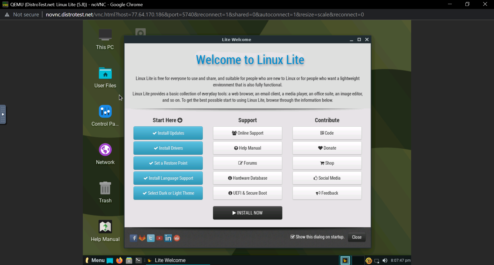
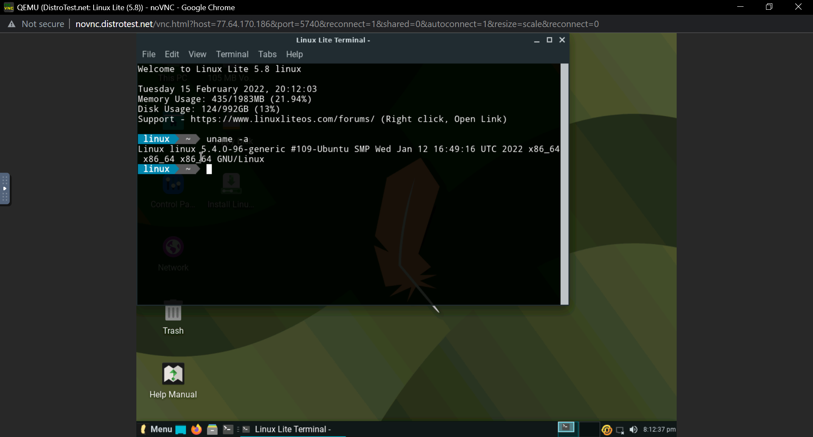
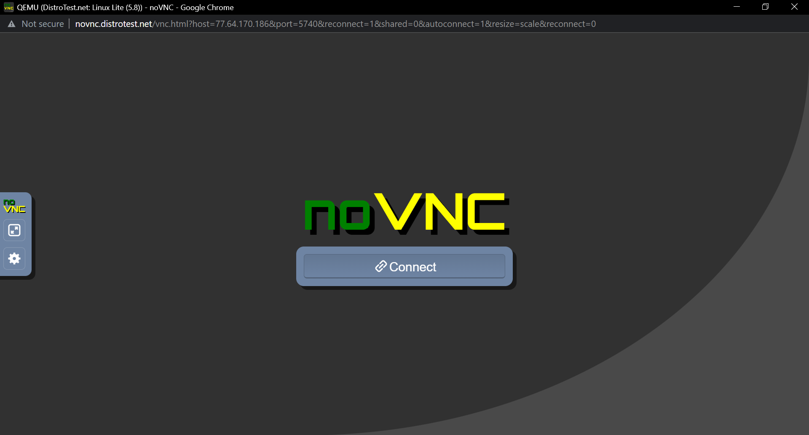

# Lab 1 Exploring Linux Distribution 

## Question 1
1. What is the OS Type: **Linux**

2. Which major distro is it based on?
**Debian**

3. Which processor architecture does it support?
**armhf, ppc64el, riscv, s390x, x86_64**

4. Is the distribution active or is it discontinued?
**Active**

5. What is the distro’s home page?
**https://www.ubuntu.com/**

## Question 2
1. What is the name of the distribution and the OS Type:
**Linux**

2. Which major distro is it based on?
**Slackware**

3. Which processor architecture does it support?
**i586, x86_64**

4. Is the distribution active or is it discontinued?
**Active**

5. What is the distro’s home page?
**http://www.porteus.org/**

## Question 3
1. What is the name of the distribution?
**MX Linux**
2. What is the country of Origin?
**Greece**
3. What major distribution is it based on?
**Debian (Stable), antiX**
4. What is the distribution category?
**Desktop, From RAM, Live Medium, Raspberry Pi**
5. Which processor architecture, aside from the one in the original query, does the OS support?
**Linux**

## Question 4

### A Linux distribution used for Data Rescue/Data recovery

| Distro Name    | Website                  | Desktop Environment                                    |
|----------------|--------------------------|--------------------------------------------------------|
| **Kali Linux** | **http://www.kali.org/** | **Enlightenment, GNOME, KDE Plasma, LXDE, MATE, Xfce** |

### A Linux distribution used for Education that supports the ix86 processor architecture.

| Distro Name     | Website               | Desktop Environment                                                                |
|-----------------|-----------------------|------------------------------------------------------------------------------------|
| **NixOS**       | **http://nixos.org/** | **Awesome, Enlightenment, Fluxbox, GNOME, i3, IceWM, KDE Plasma, Ratpoison, Xfce** |

### A Linux distribution that supports the OEM installation method

| Distro Name | Website                       | Desktop Environment     |
|-------------|-------------------------------|-------------------------|
| **Ubuntu**  | **https://www.ubuntu.com/**   | **GNOME, Unity**        |

## Question 5 

## Question 6

