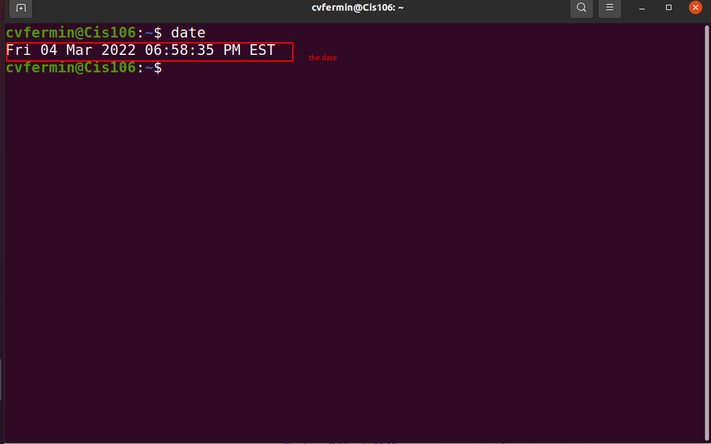
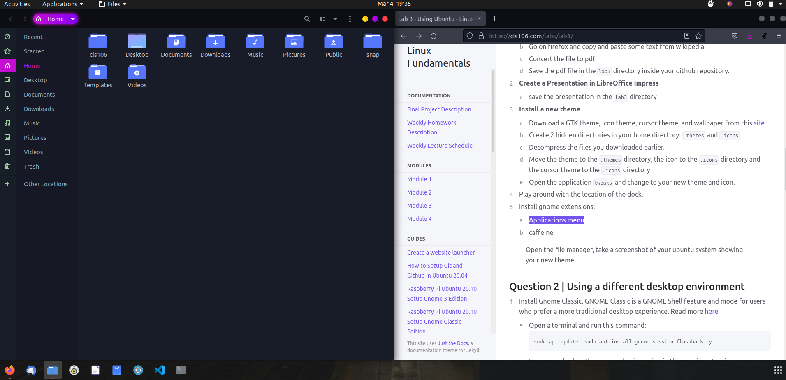
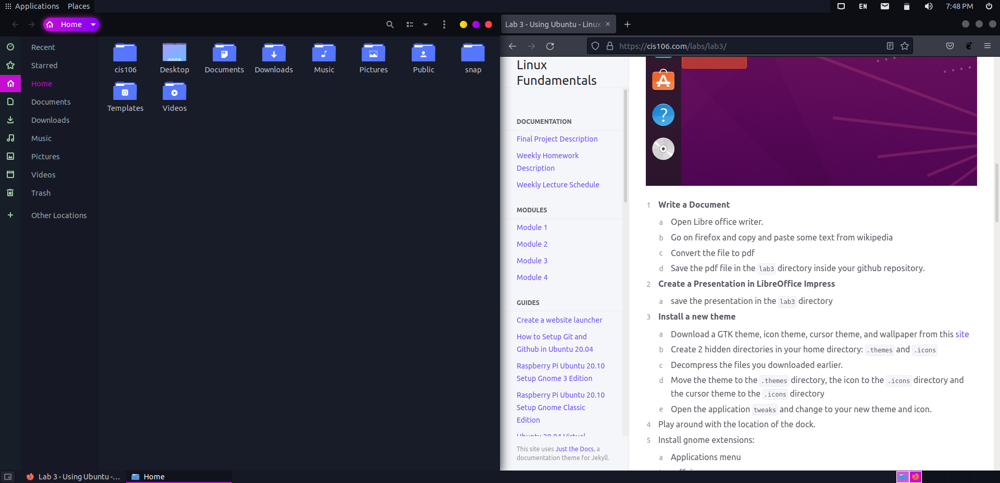

---
Name: Cristian V. Fermin
Class: cis106
Semester: Spring 22 
--- 

# Lab 3 Using Ubuntu 

# Question 1

# Question 2

# Question 3

| Program purpose     | Package Name     | Version  | Description                                                      |
| ------------------- | ---------------- | ---------| -----------------------------------------------------------------|
| Play a tetris game  | quadrapassel     |1:3.36.0-1| tetris game                                                      |
| Play a video file   | libmpv-dev       |0.32.0-1  | video player based on MPlayer/mplayer2 (client library dev files)|
| Browse the internet |   Alice          |  0.19-2  |     Web browser (WebKit or Gecko) based IRC client               |
| Read your email     | plasma-gmailfeed | 1.1-2    |        plasmoid that shows your Gmail feed with notifications    |
| Play music          | mopidy-local     | 3.1.1-1  | Mopidy extension for playing music from your local music archive |

Commands Answers: 
* Sub question 1: `sudo apt install "Package Name" -y` 
* Sub question 2: `sudo apt remove "Package Name" "Package Name" "Package Name" -y`
* Sub question 3: `sudo apt install "Package Name"+ "Package Name"- "Package Name"- -y`
`apt search "program purpose"` for searching

# Question 4
`man "Command Name"`

| command | what it does                                                   |
|---------|----------------------------------------------------------------|
| echo    | Display a Line of text                                         |
| fortune | print a random, hopefully interesting, adage                   |
| cowsay  | configurable speaking/thinking cow (and a bit more)            |
| lolcat  | rainbow coloring for text                                      |
| figlet  | display large characters made up of ordinary screen characters |
| toilet  | display large colourful characters                             |
| rig     | Random Identity Generator                                      |
