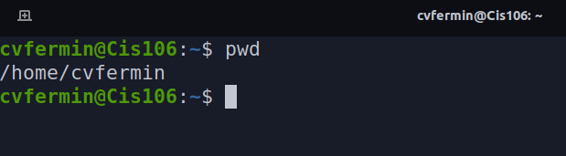

# Lab 4 | The Linux Filesystem!

## Question 1: The Linux Filesystem 
### Table 1
**Create a table that includes the following directories and their usage:**
1. bin 
2. dev 
3. etc 
4. home 
5. media 
6. opt 
7. proc 
8. srv 
9. usr
10. var

| DIRECTORY |                                                          F U N C T I O N                                                                         |
|-----------|--------------------------------------------------------------------------------------------------------------------------------------------------|
|    bin    |- Essential Commands                                                                                                                              |
|    dev    |- Device Files                                                                                                                                    |
|    etc    |- System Configuration Files                                                                                                                      |
|    home   |- User Home Directories                                                                                                                           |
|    media  |- Mount Point For Removable Media, Such As DVD's And Floppy Disc                                                                                  |
|    opt    |- Add-On Software Packages                                                                                                                        |
|    proc   |- Kernal Information, Process Control, System Hardware Information                                                                                | 
|    srv    |- Information Relating To Services That Run On The System                                                                                         |
|    usr    |- Software Not Essential For System Operation, Such As Application                                                                                |
|    var    |- Dedicated To Variable Data, Such As Logs, Databases, Websites, And Temporary Spool ( e-mail etc. ) Files That Persist From One Boot To The Next |  

### Table 2
**Create a table of the commands used for navigating the file system ( cd, pwd, ls ). YOUR TABLE MUST INCLUDE THE FOLLOWING!!:**
* The command,
* What the command does,
* The syntax/formula of how to use the commands,
* An Example/ An ie.

| Commands |                      What It Does??                                       |   Syntax   |   Examples              |
|----------|---------------------------------------------------------------------------|------------|-------------------------|
|   cd     |- Changes the current working directory. in other words, moves you around  |   cd       | cd + destination        |
|   pwd    |- Displays the current working directory (Where you are currently working) |   pwd      | pwd /home/user          |
|   ls     |- Listing the content of a given directory or the file/directory itself    |   ls       | ls -a, ls -a ~/pictures |

## Question 2

## Question 3 

## Question 4

## Question 5

