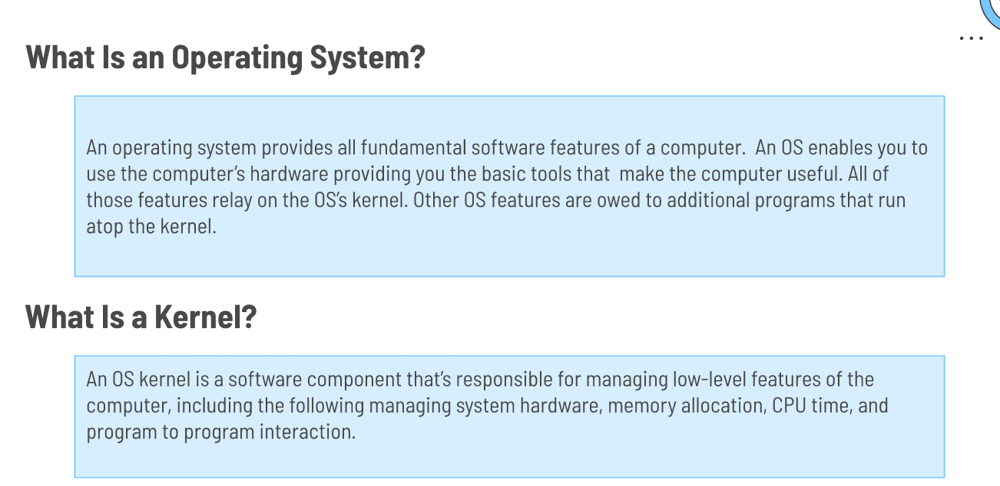
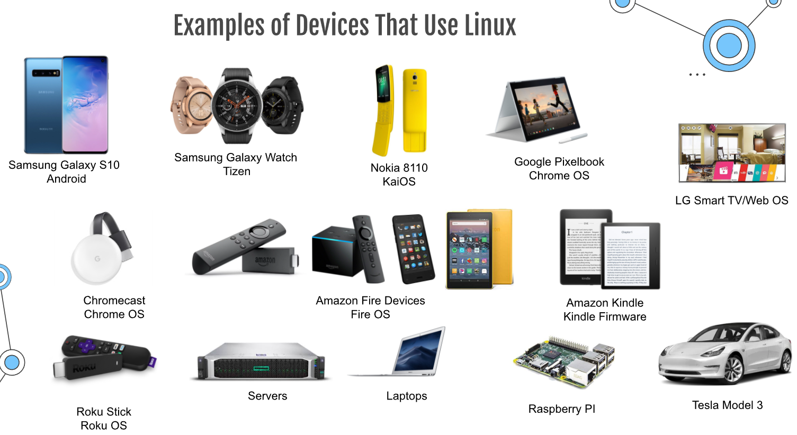
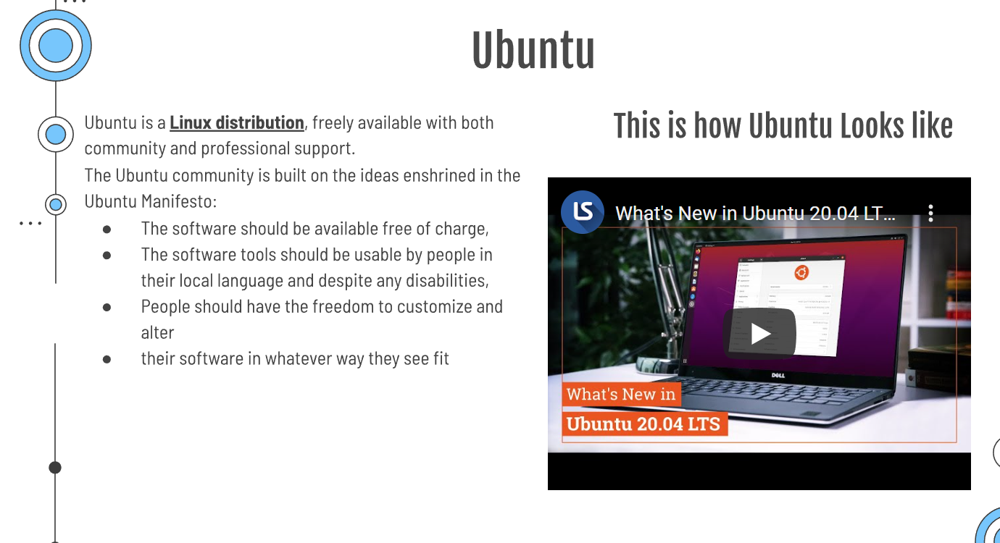
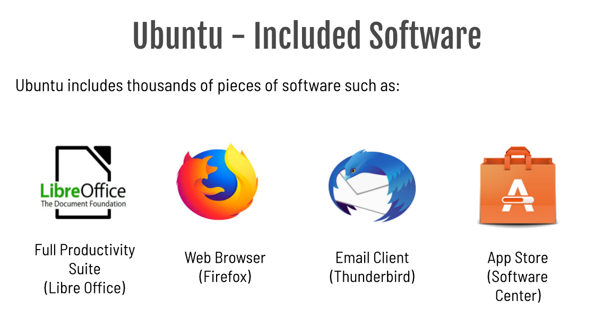
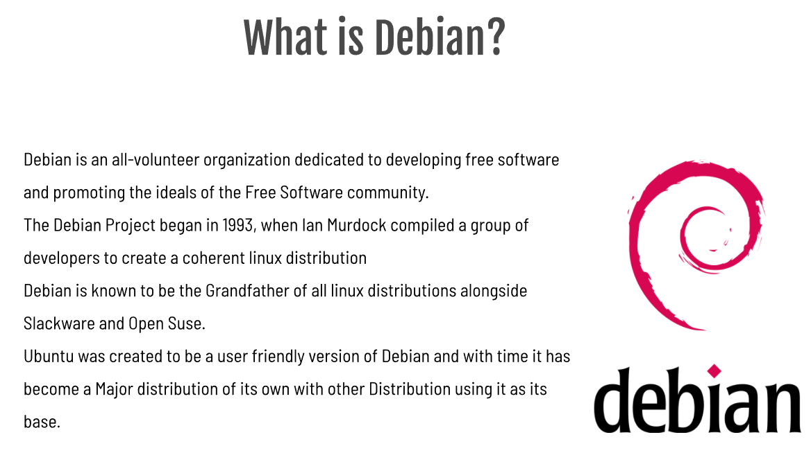
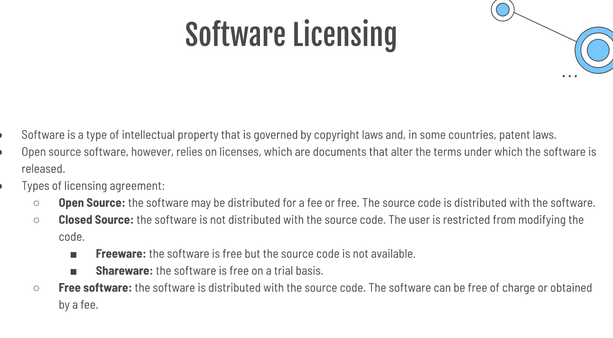
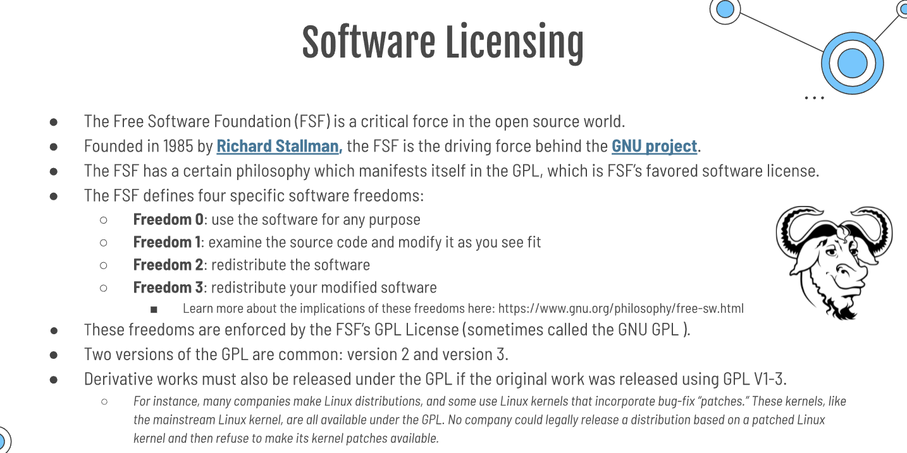

# Week Report 1
## Summary of Presentation: Introduction to Linux

## Final Project Research Questions and answers

- **What is Linux?**

Just like Windows, iOS, and Mac OS, Linux is an operating system. In fact, one of the most popular platforms on the planet, Android, is powered by the Linux operating system. An operating system is software that manages all of the hardware resources associated with your desktop or laptop. To put it simply, the operating system manages the communication between your software and your hardware. Without the operating system (OS), the software wouldn't function.

- **What is a Linux distribution?**

Linux has a number of different versions to suit any type of user. From new users to hard-core users, you’ll find a “flavor” of Linux to match your needs. These versions are called distributions (or, in the short form, “distros”). Nearly every distribution of Linux can be downloaded for free, burned onto disk (or USB thumb drive), and installed (on as many machines as you like).
LINUX MINT
MANJARO
DEBIAN
UBUNTU
ANTERGOS
SOLUS
FEDORA
ELEMENTARY OS
OPENSUSE

- **What is Ubuntu?**

Ubuntu is a complete Linux operating system, freely available with both community and professional support. The Ubuntu community is built on the ideas enshrined in the Ubuntu Manifesto: that software should be available free of charge, that software tools should be usable by people in their local language and despite any disabilities, and that people should have the freedom to customize and alter their software in whatever way they see fit.

- **What are the system requirements for installing Ubuntu 20.04**

2 GHz dual-core processor, 4 GiB RAM (but 1 GiB can work), 25 GB of hard-drive space, VGA capable of 1024×768 screen resolution, Either of the two: a CD/DVD drive or a USB port for the installer media and Optionally, Internet access is helpful.